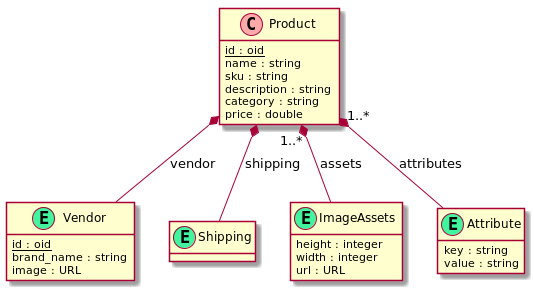
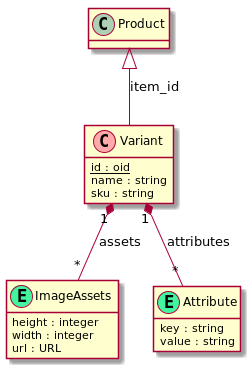
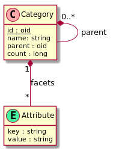
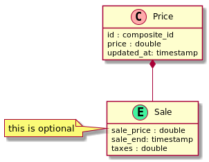

# Data model

## Productos

Un producto tiene al menos la siguiente información:

 - Item: la información general del producto (e.g. Levi’s 501)
 - Variant: una variante específica del mismo item (e.g. talla 6, color negro) que típicamente tiene definido un SKU/UPC
 - Price: la nformación de precio puede variar basado en la tienda, la variante, promociones, etc.
 - Hierarchy: la taxonomia del item, o la ubicacion por categoría dentro del catálogo
 - Facet: atributos por los que se debe buscar/filtrar otros items dentro de la taxonommia
 - Vendors: un mismo SKU debe ser porporcionado por diferentes tiendas/negocios
 


  
Un ejemplo de esta estructura quedaría de la siguiente forma: 

```json
{
    "_id": "1077182370",
    "desc": [
        {
            "lang": "es",
            "val": "Cámara Digital Canon EOS M100 EF-M 15-45mm"
        }
    ],
    "name": "Cámara Digital Canon EOS M100 EF-M 15-45mm",
    "category": "/84700/80009/1282094266/1200003270",
    "vendor": {
        "id": "2483510",
        "img": {
            "src": "http://assets.liverpool.com.mx/assets/web/logos/liverpool_logo.gif"
        },
        "name": "Liverpool México"
    },
    "assets": {
        "imgs": [
            {
                "img": {
                    "height": "1900",
                    "src": "https://ss627.liverpool.com.mx/xl/1077182370.jpg",
                    "width": "1900"
                }
            },
            {
                "img": {
                    "height": "1900",
                    "src": "https://ss627.liverpool.com.mx/xl/1077182370_2p.jpg",
                    "width": "1900"
                }
            },
            {
                "img": {
                    "height": "1900",
                    "src": "https://ss627.liverpool.com.mx/xl/1077182370_3p.jpg",
                    "width": "1900"
                }
            }
        ]
    },
    "shipping": {
        "dimensions": {
            "height": "13.0",
            "length": "1.8",
            "width": "26.8"
        },
        "weight": "1.75"
    },
    "attrs": [
        {
            "name": "Tipo de Batería",
            "value": "Ion- litio recargable lp-e12"
        },
        {
            "name": "NFC",
            "value": "true"
        },
        {
            "name": "Tipo De Disparo",
            "value": "One shot, disparo simultaneo en raw y jpg"
        },
        {
            "name": "Brand",
            "value": "CANON"
        }
    ],
    "variants": {
            "cnt": 9,
            "attrs": [
                {
                    "dispType": "DROPDOWN",
                    "name": "Color"
                },
                {
                    "dispType": "DROPDOWN",
                    "name": "Talla"
                }
            ]
        },
    "lastUpdated": 1400877254787
}
```

Campos de interés:

 - _id: el id del producto
 - lastUpdated: util para ver ls productos recientemente adicionados/modificados
 - category: el camino de categorías hecho a partir de la taxonomia de productos
 - name: nombre del producto
 - vendor: tienda/comercio que vende el producto
 - desc: lista de descripciones (website, retail box, etc)
 - assets: lista de recursos (images, etc)
 - attrs: lista de attributos como pares name-value. Será usado para implementar el facetado. Notese que puede haber información duplicada en estos atributos.
 - variants: alguna información sobre las variantes, pero no las variantes en si mismas. Permite dar información de que diferencian cada variante del producto.

### Consultas comunes (indexadas):

Busqueda por id:

`{ _id: "the product id" }`

Busqueda por prefijo de categoría:

`{ product.cat: { $regex: "^category prefix" } }`

Buscar por prefijo de nombre de producto case-insensitive:

`{ product.name: /^name prefix/i } }`

## Variant model

Este modelo representa variaciones especificas de un producto. Muchos productos no tienen variantes (e.g. un TV no tiene otras opciones) mientras que otros pueden tener muchas.


 
Aquí ejemplo para unos zapatos:

```json
{
    "_id": "05458452563",
    "name": "Ancho:Medio,Color:Marfil,Talla:25.6",
    "itemId": "054VA72303012P",
    "altIds": {
        "upc": "632576103580"
    },
    "assets": {
        "imgs": [
            {
                "width": "1900",
                "height": "1900",
                "src": "http://c.shld.net/rpx/i/s/i/spin/image/spin_prod_945348512"
            },
            {
                "width": "1900",
                "height": "1900",
                "src": "http://c.shld.net/rpx/i/s/i/spin/image/spin_prod_945348612"
            }
        ]
    },
    "attrs": [
        {
            "name": "Ancho",
            "value": "Medio"
        },
        {
            "name": "Color",
            "family": "Blanco",
            "value": "Marfil"
        },
        {
            "name": "Talla",
            "value": "6.5"
        }
    ]
}
```

Campos dei interés:

 - _id: el SKU
 - itemId: el id del producto al que pertenece
 - attrs: la lista de atributos especificos de la variante. Notese que algunos atributos pueden tener un valor especifico (e.g. marfil) y una familia (e.g. blanco) para facilitar la busqueda de productos similares.
 - assets: lista de recursos (images, etc con las caracteristicas especificas de la variante)
 
### Consultas comunes (indexadas):

Buscar por SKU:

`{ _id: "the sku" }`

Buscar por producto:

`{ itemId: "item id" }`

## Categorias

El documento representa un arbol jerarquico representando la taxonomia de productos. Los nodos de más alto nivel representan departamentos, mientras que los inferiores representan las vategorias especificas. 



Aqui un ejemplo de una categoría:

```json5
{
    "_id": "1200003270",
    "name": "Laptops",
    "count" : 567,
    "parent": "1282094266",
    "facets": [
        "Fabricante",
        "Tipo",
        "Color",
        "Procesador",
        "Memoria",
        "Disco Duro",
        "Pantalla",
        ...
    ]
}
```

Campos de interés:

 - _id: id de la categoría
 - name: nombre de la categoría
 - count: numero de elementos en esta categría. Puede ser util para mostrar información estadistica, tambien puede calcularse muy facilmente.
 - parent: categoría superior 
 - facets: lista de facetas que existen en la categría. Esta información es util para mostrar las facetas disponibles en el buscador del productos.

### Consultas comunes

Buscar por categoria padre 

```json
{ parent : "parent id" }
```

buscar los departamentos:

```json
{ parent : null }
```

## Price model

Queremos que el precio sea suceptible a cmbios dependiendo de varios factores (varinte, tienda, ofertas). La decision natural sería tener el precio en el modelo del producto/variante pero, en ese caso tendríamos documentos repetidos con precios diferentes para poder cubir todos los casos del negocio. Imaginemos que tenemos unas mil tiendas, si implementamos esta version tendríamos `1000 tiendas x 200m variantes = 2billones de precios`. En ves de eso podemos hacer uso de las capacidades de MongoDB y tener una colección independiente para manejar los precios, así mantenemos los precios en el orden de los millones acorde a la cantidad de productos/variantes. 



Un precio sería de la siguente forma: 

```json
{
    "_id": "SPM8824542513_1234",
        "price": "69.99",
        "sale": {
            "salePrice": "42.72",
            "saleEndDate": "2050-12-31 23:59:59"
        },
    "lastUpdated": 1374647707394
}
```

Campos de interrés

 - _id: el id se construye de forma especifica, es la concatenación de la informacion del item y la tienda (vendor). La información del item sería el id del producto o de la variante (SKU). La información de la tienda es el id de la tienda.
 - price: el precio actual
 - sale: informacion de ventas, es opcional y depende del modelo de negocio que se quiera perseguir con las ofertas de precio.

### Consultas comunes

Buscar todos los precios de un item:

`{ _id: { "$regex": "^itemId_" } }`

Buscar todos los precios por SKU:

`{ _id: { "$in: [ { "$regex": "^itemId_" }, { "$regex": "^sku_" } ] }`

Buscar precio por SKU y vendor:

`{ _id: { "$in: [ "itemId_vendorId", "sku_vendorId" ] }`

Buscar items en oferta, empezando por aquellos que terminan primero (teniendo un `sparse index` en `sale.saleEndDate`):

`{ "sale.saleEndDate": { $ne: null } } ordenando por { "sale.saleEndDate": 1 }`
